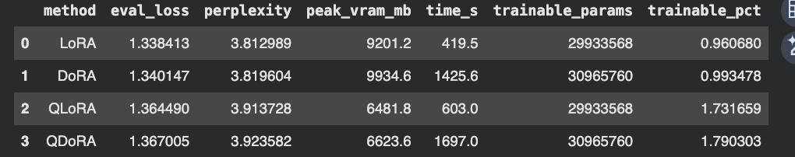
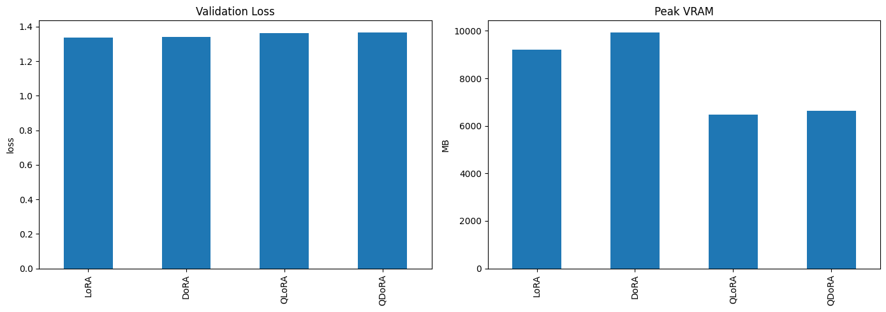

# LoRA vs DoRA vs QLoRA vs QDoRA: Empirical Benchmark on Qwen2.5-3B

An empirical evaluation of four parameter-efficient fine-tuning methods under constrained hardware conditions. All experiments run on a single NVIDIA T4 GPU (16 GB VRAM) via Google Colab.

---

## Results





| Method | Eval Loss ↓ | Perplexity ↓ | Peak VRAM ↓ | Train Time ↓ | Trainable Params |
|--------|-------------|--------------|-------------|--------------|-----------------|
| LoRA   | 1.3384      | 3.8130       | 9201 MB     | 419.5s       | 29.9M (0.961%)  |
| DoRA   | 1.3401      | 3.8196       | 9935 MB     | 1425.6s      | 31.0M (0.993%)  |
| QLoRA  | 1.3645      | 3.9137       | 6482 MB     | 603.0s       | 29.9M (1.732%)  |
| QDoRA  | 1.3670      | 3.9236       | 6624 MB     | 1697.0s      | 31.0M (1.790%)  |

---

## Methods

### LoRA (Hu et al., 2022)

Freezes pretrained weights W₀ and approximates the weight update as a low-rank decomposition ΔW = BA where B ∈ R^(d×r) and A ∈ R^(r×k), r ≪ min(d,k). A is Kaiming-initialized; B is zero-initialized ensuring ΔW = 0 at step 0. Adapters merge into base weights post-training with zero inference overhead. At r=16 this yields less than 1% trainable parameters.

### DoRA (Liu et al., 2024)

Extends LoRA via weight decomposition. Any weight matrix W is expressed as W = m · (V / ||V||_c) where m is a per-column magnitude vector and V is the direction matrix. DoRA trains both components: LoRA handles directional updates (ΔV = BA), a float16 magnitude vector handles scaling. The full update is W' = (m / ||V + ΔV||_c) · (V + ΔV).

The paper shows LoRA produces a positive ΔM/ΔD correlation across training steps — magnitude and direction changes scale proportionally. Full fine-tuning produces a negative slope — large directional shifts with small magnitude shifts, or vice versa. DoRA reproduces the negative slope, theoretically enabling more granular weight adaptation. The paper recommends detaching ||V + ΔV||_c from the gradient graph to reduce backprop memory by ~24.4%.

### QLoRA (Dettmers et al., 2023)

Loads base weights in NF4 (Normal Float 4-bit) quantization — a data type whose quantization grid is optimized for normally distributed weights, minimizing information loss vs uniform int4. Double quantization further quantizes the per-block quantization constants from float32 to float8, saving ~0.5 bits/parameter. LoRA adapters run in float16. Base weights dequantize on-the-fly during the forward pass. `prepare_model_for_kbit_training()` casts layer norms to float32 and enables gradient checkpointing.

### QDoRA

Applies DoRA on top of a QLoRA-quantized base. Magnitude vector in float16, directional LoRA adapters in float16, base weights in NF4. The DoRA paper reports QDoRA accuracy of 0.31 on Orca-Math vs QLoRA's 0.12 and full fine-tuning's 0.26 — the strongest result in their quantized fine-tuning comparison.

---

## Experimental Setup

**Hardware:** NVIDIA T4 16 GB, Google Colab

**Model:** `Qwen/Qwen2.5-3B-Instruct`

**Dataset:** `yahma/alpaca-cleaned` — 300 train / 80 validation samples, Alpaca instruction format

**Hyperparameters (identical across all methods):**

```
rank (r)              : 16
lora_alpha            : 32
lora_dropout          : 0.05
target_modules        : q_proj, k_proj, v_proj, o_proj,
                        gate_proj, up_proj, down_proj
learning_rate         : 2e-4
lr_scheduler          : cosine
max_steps             : 80
per_device_batch_size : 1
gradient_accumulation : 8   (effective batch size: 8)
max_seq_length        : 64
optimizer             : paged_adamw_8bit
precision             : fp16
seed                  : 42
```

**Quantization config (QLoRA / QDoRA):**
```python
BitsAndBytesConfig(
    load_in_4bit=True,
    bnb_4bit_quant_type="nf4",
    bnb_4bit_compute_dtype=torch.float16,
    bnb_4bit_use_double_quant=True,
)
```

---

## Analysis

### Quality

LoRA and DoRA are statistically tied at this training scale. The 0.0017 loss gap is below the noise floor for an 80-step run. DoRA's advantage — more expressive weight updates via magnitude/direction decomposition — requires sufficient gradient signal to compound into measurable quality differences. At 80 steps on 300 samples, no method has converged. The gap between LoRA and DoRA in the paper (e.g. +3.7% on LLaMA-7B commonsense) emerged from full-dataset training with thousands of steps.

QLoRA vs QDoRA is similarly tied at 0.0025 delta.

### Memory

The 29.5% VRAM reduction from LoRA to QLoRA (9.2 GB → 6.5 GB) is the most actionable result. NF4 double quantization introduces a fixed quantization noise floor; the LoRA adapters partially compensate during training but cannot fully recover the precision loss. The residual 1.9% quality degradation represents the irreducible cost of 4-bit base weights at this model scale.

DoRA's 8% VRAM overhead vs LoRA (9.2 → 9.9 GB) comes from magnitude gradient storage and the additional forward-pass computation for column-wise normalization.

### Training Time

DoRA's 3.4× training time overhead is the most practically significant result. The backward pass through the magnitude scaling adds compute at every step. On a T4, which has ~65 TFLOPS of FP16 throughput vs ~312 TFLOPS on an A100, this overhead is proportionally more severe. A hyperparameter sweep taking 30 minutes with LoRA takes over 2 hours with DoRA on equivalent hardware.

---

## Key Findings

**QLoRA is the practical optimum on T4.** 29.5% VRAM reduction for 1.9% quality degradation is an unambiguous win for constrained hardware. It's the difference between fitting on a T4 and OOM-crashing on smaller GPUs.

**DoRA needs scale to show its advantage.** The theoretical basis is sound — the ΔM/ΔD analysis in the paper is compelling — but the gains only manifest with larger datasets, longer schedules, and harder reasoning tasks. Don't expect it to outperform LoRA on short runs.

**DoRA's time cost is non-trivial.** 3.4× training overhead is the number most people miss when reading the DoRA paper. Budget for it before committing to DoRA in a training pipeline.

---

## Limitations

- 64 token max sequence length truncates most Alpaca responses — all methods are evaluated on partial outputs
- Single seed per method — no confidence intervals on the reported gaps
- 80 steps captures early training dynamics, not convergence behavior
- Results are specific to Qwen2.5-3B; different model families may show different scaling behavior

---

## Reproduce

```bash
git clone https://github.com/Jay-Aditya-16/qwen-peft-benchmark
# Open benchmark.py in Google Colab with T4 GPU
# Runtime → Change runtime type → T4
```

**Dependencies:**
```bash
pip install transformers>=4.45 accelerate bitsandbytes>=0.45
pip install peft>=0.14 datasets sentencepiece
pip install pandas matplotlib seaborn
```

---

## References

- Hu et al. (2022). *LoRA: Low-Rank Adaptation of Large Language Models.* ICLR 2022.
- Dettmers et al. (2023). *QLoRA: Efficient Finetuning of Quantized LLMs.* NeurIPS 2023.
- Liu et al. (2024). *DoRA: Weight-Decomposed Low-Rank Adaptation.* arXiv:2402.09353.
- Qwen Team (2024). *Qwen2.5 Technical Report.*
